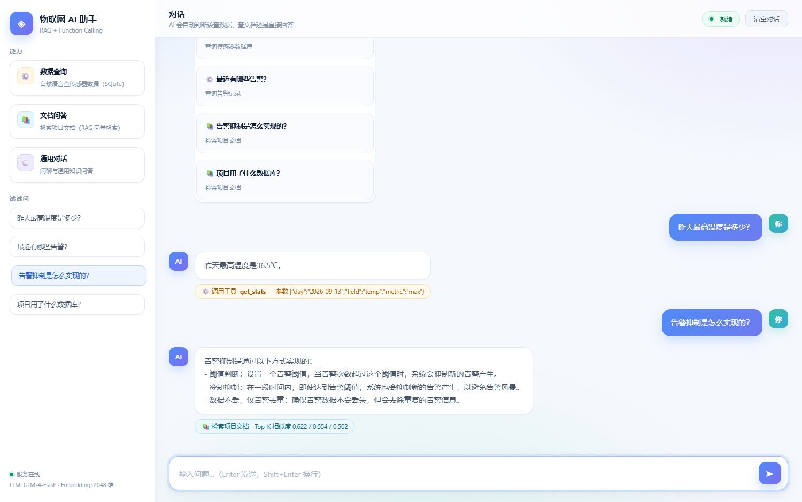

# IoT Operations Agent

面向 ESP32 温湿度设备的**多步 Agent**。它不再只是“把问题路由到某个接口”，而是会拆解任务、逐步选择工具、检查执行结果，并在写操作前暂停等待用户确认。



演示覆盖多步工具调用、RAG 来源展示与写操作确认流程。

## 核心能力

- **多步决策**：Planner 每一步只选择一个动作，读取工具结果后继续规划，直到能够给出结论。
- **原生 Function Calling**：优先使用 GLM 的 `tools/tool_calls` 接口；不支持时回退到结构化 JSON 规划。
- **状态持久化**：SQLite 保存会话、每一步决策、工具输入输出、错误和耗时。
- **安全边界**：写操作必须二次确认；默认数据库连接为只读；最多执行 8 步；重复调用会被熔断。
- **可解释 Trace**：前端展示工具选择、调用结果和耗时，不展示模型私有思维链。
- **安全评估**：内置 20 条任务的数据集，可统计任务成功率、平均步数、P95 延迟和危险写操作拦截情况。
- **确定性快路径**：明确的计数、趋势、文档问题直接执行固定工具；模糊和多意图任务仍由 LLM 选择工具。

## 工具

| 工具 | 权限 | 说明 |
|---|---|---|
| `get_sensor_stats` | read | 查询最高、最低、平均或数据条数 |
| `get_sensor_readings` | read | 查询原始传感器记录 |
| `analyze_trend` | read | 计算趋势、极值、平均值和阈值异常数 |
| `list_alerts` | read | 查询最近告警 |
| `search_iot_docs` | read | RAG 检索项目文档 |
| `create_alert_rule` | write | 创建告警规则，需要确认 |
| `send_notification` | write | 发送 Webhook 通知，需要确认 |

## 运行流程

```text
用户任务
   ↓
Planner 选择下一步
   ↓
Executor 验证参数并执行工具
   ↓
Verifier 检查动作是否合法
   ↓
写操作？── 是 → 用户确认 / 拒绝
   │
  否
   ↓
检查工具结果 → 继续规划或输出结论
```

## 快速开始

```bash
python3 -m venv .venv
source .venv/bin/activate
pip install -r requirements.txt

cp config.example.py config.py
# 填入智谱 API Key

python3 build_index.py
python3 app.py

`build_index.py` 默认索引仓库内的 `docs/knowledge/`；可通过 `--doc <path>` 指定其他 Markdown/TXT 文件或目录。
```

打开 `http://localhost:5001`。

也可以使用环境变量而不是 `config.py`：

```bash
export GLM_API_KEY="..."
export GLM_API_URL="https://open.bigmodel.cn/api/paas/v4/chat/completions"
export GLM_MODEL="glm-4-flash"
export IOT_DB_PATH="$HOME/iot-lab/logs/sensor.db"
```

## Docker

```bash
export GLM_API_KEY="..."
docker compose up --build
```

默认将 `./data` 作为 Agent 运行数据目录。需要完整使用传感器工具时，将 `sensor.db` 放入 `data/`，或修改 `IOT_DB_PATH`。

## API

```bash
curl -X POST http://localhost:5001/api/chat \
  -H 'Content-Type: application/json' \
  -d '{"question":"先看最近3条读数，再分析温度趋势"}'
```

返回字段：

- `session_id`：后续对话使用的会话 ID；
- `status`：`completed`、`awaiting_confirmation`、`needs_input` 或 `failed`；
- `answer`：最终回答；
- `pending_action`：待确认写操作；
- `trace`：工具调用和执行结果。

确认或拒绝写操作：

```bash
curl -X POST http://localhost:5001/api/confirm \
  -H 'Content-Type: application/json' \
  -d '{"token":"TOKEN"}'

curl -X POST http://localhost:5001/api/reject \
  -H 'Content-Type: application/json' \
  -d '{"token":"TOKEN"}'
```

## 测试

```bash
python3 -m unittest discover -s tests -v
```

覆盖内容包括：JSON Schema 参数校验、未确认写操作拦截、多步工具执行、确认后写入、重复调用熔断，以及文档分块、索引元数据和混合检索排序。

## 评估

```bash
python3 eval/run_eval.py
```

详细结果输出到 `eval/results.json`。本仓库最新一次真实模型评估见 `eval/RESULTS.md`。指标包括：

- Task Success Rate
- Average Tool Steps
- P95 Latency
- Write Actions Executed Without Confirmation

评估集位于 `eval/tasks.jsonl`，建议继续扩展到 30 条以上，并增加真实失败案例。

RAG 检索单独评测：

```bash
python3 eval/run_rag_eval.py
```

最新结果见 `eval/RAG_RESULTS.md`：在 35 条人工标注问题上，`Recall@3 = 35/35`，`Top-1 Accuracy = 30/35 (85.7%)`，`MRR = 0.919`。该结果用于开发期回归，不代表生产环境检索质量。

## 项目结构

```text
iot_agent/
├── llm.py        # LLM / Embedding / 原生 Function Calling
├── models.py     # 会话状态与步骤模型
├── planner.py    # Planner
├── runtime.py    # Executor / Verifier / Agent 主循环
├── settings.py   # 环境配置
├── storage.py    # SQLite 会话与待确认操作
├── tools.py      # 工具契约与 Schema 校验
└── web.py        # Flask API
eval/
├── run_eval.py
├── tasks.jsonl
├── run_rag_eval.py
├── rag_tasks.jsonl
└── RAG_RESULTS.md
docs/knowledge/
└── iot-monitor.md
tests/
├── test_agent.py
└── test_build_index.py
```

## 当前限制

- RAG 使用本地内存向量与 IDF 加权关键词混合检索，适合小规模文档；下一步可替换为向量数据库和重排序。
- 评估集规模仍较小，需要继续补充真实设备异常、工具失败和 Prompt Injection 场景。
- 多用户鉴权、速率限制和生产级可观测性尚未完成。
- 发送通知依赖 `/app/data/notify_config.json` 或本机 `notify_config.json` 中的 Webhook 配置。
